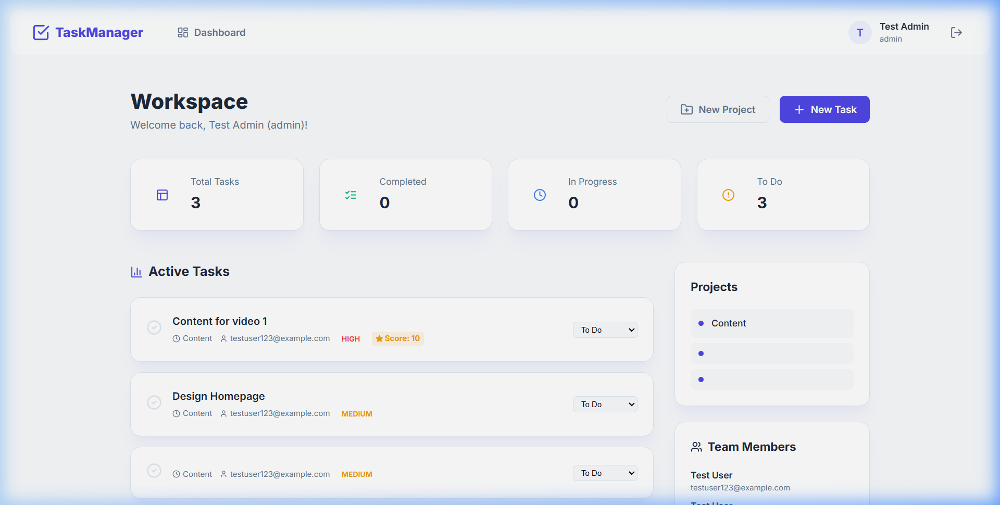
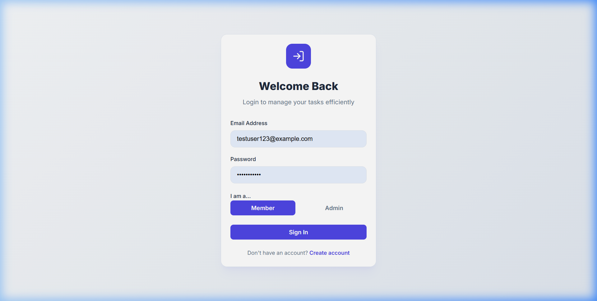
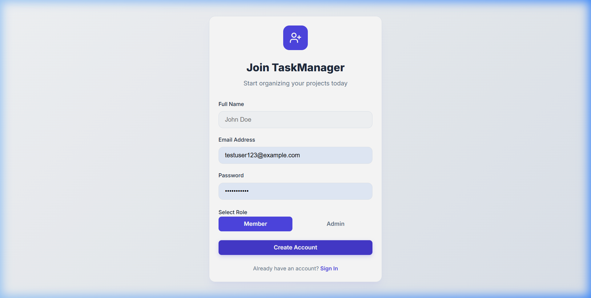

# 🚀 TaskManager Elite
[](https://task-manager-2-sigma.vercel.app/)
[](https://www.mongodb.com/cloud/atlas)
[](https://fastapi.tiangolo.com/)

A premium, enterprise-grade task orchestration platform engineered with a high-end **Indigo Glassmorphism** aesthetic. Designed for seamless team collaboration, performance auditing, and intelligent resource management.

## 🔗 Live Demo
**Production URL**: [https://task-manager-2-sigma.vercel.app/](https://task-manager-2-sigma.vercel.app/)

---

## 📸 Product Showreel

### Adaptive Dashboard


### Secure Authentication
| Login Experience | Signup Experience |
| :---: | :---: |
|  |  |

---

## ✨ Elite Features

### 🛠️ Full Lifecycle Management
- **Universal CRUD**: Comprehensive orchestration for both **Projects** and **Tasks**.
- **Admin Command Center**: Exclusive permissions to create, edit, and delete workspace assets.
- **Cascading Integrity**: Intelligent database triggers that clean up associated task records when projects are retired.

### 📊 Performance Auditing (Admin Only)
- **Quality Scoring**: Evaluate task execution with a precise 1-10 scoring system.
- **Real-time Evaluation**: Immediate feedback loop between admins and members.

### 🎨 Intelligent Performance Visualization
- **Color-Coded Ecosystem**: Instant performance identification using a specialized chromatic scale:
  - 🔴 **0-3 (Needs Improvement)**: Critical focus required.
  - 🟠 **4-8 (Stable Performance)**: Reliable output level.
  - 🟢 **9-10 (Elite Execution)**: Top-tier productivity.
- **Universal Ratings**: Performance indicators integrated across Task Cards, the Team Sidebar, and User Profiles.

### 🔐 Advanced RBAC (Role-Based Access Control)
- **Tailored Dashboards**: The interface dynamically reconfigures itself based on user roles:
  - **Admins**: View "Team Workspace" with global analytics and management tools.
  - **Members**: View "Your Workspace" with personalized performance metrics and "Your Rating" stats.

---

## 🛠️ Technology Stack

### Frontend
- **Framework**: React 18 (Hooks, Context API)
- **Build Tool**: Vite
- **Styling**: Vanilla CSS (Custom Glassmorphism Design System)
- **Icons**: Lucide React
- **Analytics**: Recharts (Pie & Bar Distributions)

### Backend
- **Framework**: FastAPI (Python 3.11+)
- **Database**: MongoDB Atlas (Async Motor Driver)
- **Auth**: PyJWT, Bcrypt (Salt-secured hashing)
- **Deployment**: Vercel Serverless Functions

---

## 🚀 Installation & Local Development

### Prerequisites
- Node.js (v18+)
- Python (v3.11+)
- MongoDB Atlas Account

### 1. Clone & Setup
```bash
git clone https://github.com/himanshu-662/Task-Manager-2.git
cd Task-Manager-2
```

### 2. Backend Configuration
```bash
cd backend
python -m venv venv
source venv/bin/activate  # On Windows: venv\Scripts\activate
pip install -r requirements.txt
```
Create a `.env` file in the `backend` folder:
```env
MONGODB_URI=your_mongodb_atlas_connection_string
JWT_SECRET=your_secure_random_key
PORT=5001
```

### 3. Frontend Configuration
```bash
cd ../frontend
npm install
npm run dev
```

---

## 📄 License

This project is licensed under the MIT License - see the [LICENSE](LICENSE) file for details.

---

Built with precision by [Himanshu](https://github.com/himanshu-662)
